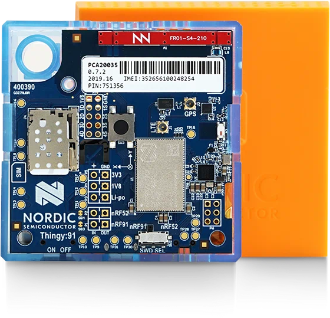
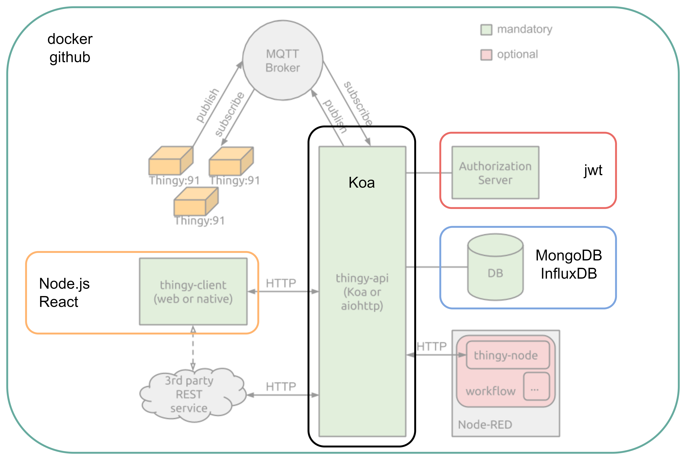

# thingy-api-Yellow
[](https://app.codacy.com?utm_source=gh&utm_medium=referral&utm_content=&utm_campaign=Badge_grade)
## Introduction
Our project is Bike Accident Detection. 

### Introduction to the problem

Many individuals (elderly, cyclists, scooter users) are vulnerable to falls, which can lead to serious injuries.

### Key Goal

Detect falls in real-time and initiate emergency protocols to help users who are incapacitated.

### Thingy:91 

attached to a mobility device (bike, wheelchair, etc.).Detects falls and emits sound alarms. Automatically contacts emergency services if the user doesn’t respond within 30 seconds, using GPS for location tracking.



### Core Features

- Detection: Trigger alarms when an abrupt fall is detected.
- Emergency Alerts: Automatic emergency calls after 30 seconds with GPS location.
- Mobility Mode Customization: Switch between bike, wheelchair, scooter, etc., to optimize data processing.
- Surrounding ambient: detects the temperature, light, air humidity, etc. to display on the app


### Architecture



## Installation

1. Clone the repository:

    ```bash
    git clone https://github.com/yourusername/thingy-api-Yellow.git
    ```

2. Navigate to the project directory:

    ```bash
    cd thingy-api-Yellow
    ```

## Configuration

Create a `.env` file in the root directory and add the following environment variables:

```
MONGODB_URI = ''

INFLUXDB_URI = ''
INFLUXDB_TOKEN = ''
INFLUXDB_ORG = ''
INFLUXDB_BUCKET = ''

MQTT_USR = ''
MQTT_PWD = ''
MQTT_SERVER = ''
MQTT_PORT = 

JWT_SECRET = ''

```

Replace the placeholders with your actual configuration values.

## Build from source

make sure InfluxDB and MongoDB are running in the background. 

For InfluxDB, it is necessary to do initial setup:

```bash
docker run -d -p 8086:8086 \
	--name bike-influxdb \
    -v "$PWD/data-influxdb:/var/lib/influxdb2" \
    -v "$PWD/config-influxdb:/etc/influxdb2" \
    -e DOCKER_INFLUXDB_INIT_MODE=setup \
    -e DOCKER_INFLUXDB_INIT_USERNAME=admin \
    -e DOCKER_INFLUXDB_INIT_PASSWORD=adminadmin \
    -e DOCKER_INFLUXDB_INIT_ORG=Yellow \
    -e DOCKER_INFLUXDB_INIT_BUCKET=YellowBucket \
    -e DOCKER_INFLUXDB_INIT_ADMIN_TOKEN=my-super-secret-auth-token \
    influxdb:2

```

To run MongoDB:

```bash
docker run -d -p 27017:27017 \
	--name bike-mongodb \
	-v "$PWD/data-mongodb:/data/db" \
	mongo:8.0.4
```

Install dependencies:

```bash
npm install
```

Start the server:

```bash
npm start
```

The API will be running at `http://localhost:3000`.

## Deployment
For production deployment, use Docker Compose:

```bash
docker-compose up
```

## API Documentation

Refer to the `ASE2024-Yellow-Sprint1-API.yml` and `ASE2024-Yellow-Sprint2-API.yml` files for detailed API endpoint information.

## Contribution
### directory structure

- controllers: contains implementation of API
- docs: contains some information for developers, e.g. how to use a certain package
- models: contains schemas for database
- mqtt: contains logics regarding MQTT
- routes: contains paths of API
- utils: contains some useful functions

